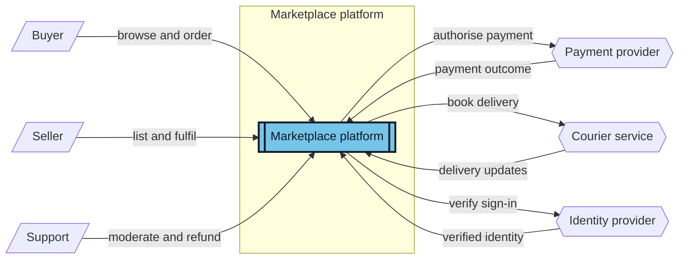

# System Context Diagram — reference-calibrated prompt

A system context diagram is the single high-level view of the product boundary:
people and external systems surround one opaque product box. It is **not** a
component diagram, integration catalogue, or workflow.

## Visual target

Use the supplied Visual Paradigm-style reference as the presentation target:

- one centred, visibly blue system boundary and one opaque product node inside it;
- simple external people in one clean left column, with external systems in a
  clean opposing right column rather than scattered around the page;
- solid, horizontal association lines with short labels; no crossing connectors,
  no paragraphs on an arrow, and no internal implementation detail;
- generous white space, dark readable connector lines, black text, and a compact
  engineering-document composition.

Mermaid has no native UML stick figure or 3D system-boundary primitive. Use its
nearest stable equivalents: a slanted actor node (`actor[/"Role"/]`), a distinct
external-service node (`service{{"External service"}}`), and an emphasized
double-border system node (`sys[["Product name"]]`). Do not imitate a shape by
adding decorative text or fake ASCII art.

## Required Mermaid composition

- Start with `flowchart LR`. Let the incoming people read left-to-right into the
  product, and place external integrations on the right.
- Draw exactly one `subgraph` titled with the product/system boundary. It contains
  only the single opaque `sys` node; no module, database table, API, or process
  may appear inside it.
- Give `sys` a restrained blue fill and strong dark border through `classDef
  system`; keep all surrounding nodes white or very pale.
- Use short role labels (`Buyer`, `Seller`, `Support`) and short interaction
  labels (normally 2–5 words such as `browse catalogue`, `authorise payment`,
  `delivery updates`). Move detailed business rules to the SRS prose.
- Combine closely related roles or integrations only when the SRS supports the
  combined label. Prefer at most 3 role nodes on the left and at most 3
  integration nodes on the right; for example, combine visitor and shopper as
  `Buyer`, or support and administration as `Platform staff`, when their
  context-level relationship is the same. Select the most important supported
  relationships instead of drawing every SRS detail; the picture must remain
  readable without zooming.
- Keep the three role nodes and three integration nodes vertically ordered and
  aligned as columns. Use no more than 3 short labelled arrows into the system
  and 6 short labelled arrows to or from integrations. Never add invisible
  layout links, long prose labels, or crossing loops to force a layout.
- For a real two-way integration, use two clearly opposite, short labelled
  arrows. Do not label an edge merely `uses`, `calls`, `data`, or `API`.
- Omit an owned database unless the SRS needs it at the context boundary. If it
  is shown, use `db[("Owned data store")]` outside the system box and label the
  data relationship.

## Content discipline

Every role, integration and relationship must come from the supplied SRS slice.
Select the most important supported interactions when the specification contains
too much detail for one clean figure. Return Mermaid source only.

## Shape-and-layout example — replace every product fact with SRS evidence

